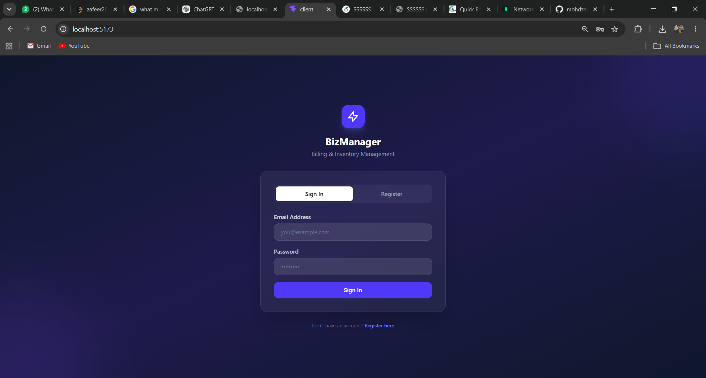
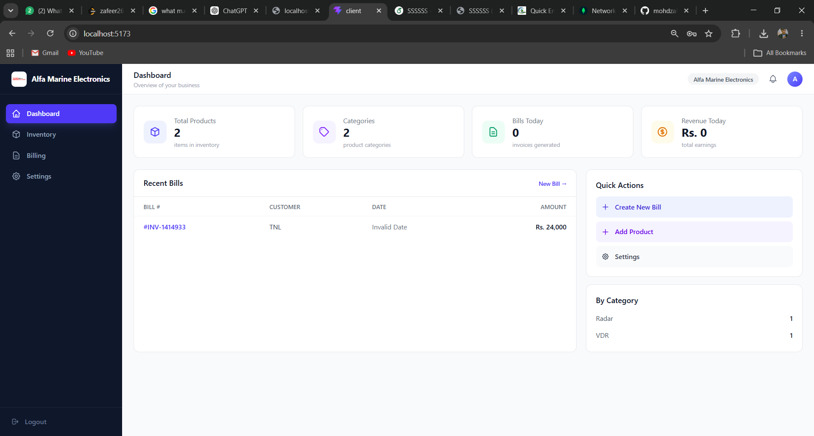
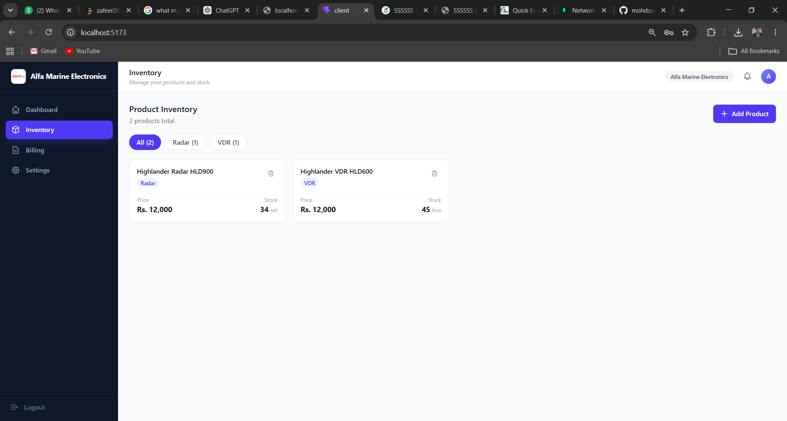
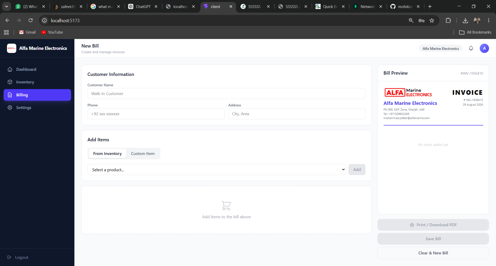
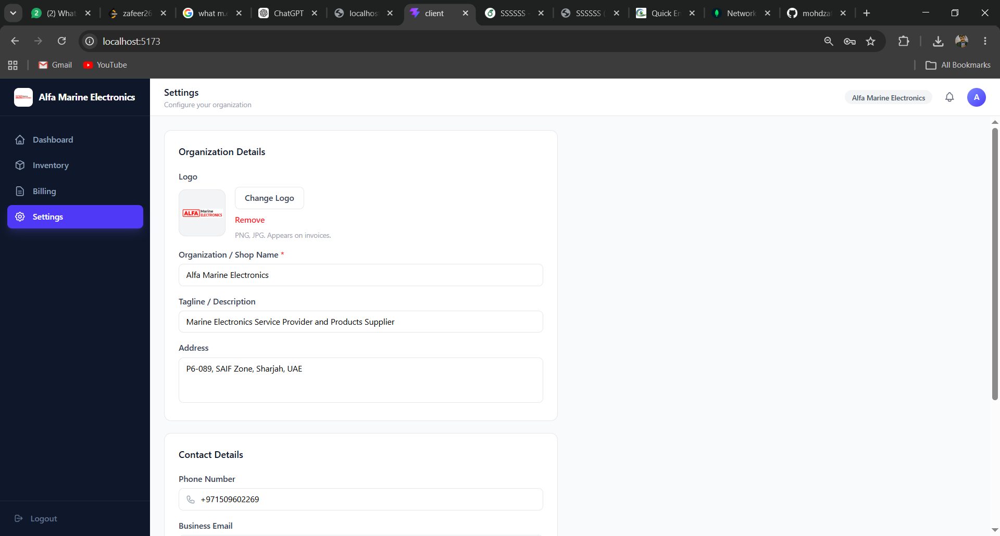

# BizManager — Billing & Inventory Management System

A full-stack web application that lets shop owners and small businesses manage their product inventory, generate professional invoices, and track daily sales — all from one clean dashboard.

---

## Table of Contents

- [Overview](#overview)
- [Features](#features)
- [Tech Stack](#tech-stack)
- [Project Structure](#project-structure)
- [Getting Started](#getting-started)
- [How to Use](#how-to-use)
  - [Register / Login](#1-register--login)
  - [Dashboard](#2-dashboard)
  - [Inventory Management](#3-inventory-management)
  - [Billing & Invoices](#4-billing--invoices)
  - [Settings](#5-settings)
- [API Reference](#api-reference)
- [Screenshots](#screenshots)

---

## Overview

BizManager is designed for small shops, general stores, and businesses that need a lightweight but complete system to:

- Keep track of what products they have and at what price
- Create bills for customers in seconds
- Download or print professional PDF invoices
- Store their organization's branding and contact details

Every user's data is fully isolated — products, bills, and settings are tied to their account.

---

## Features

| Feature | Description |
|---|---|
| Authentication | Register with organization name, login with email + password, JWT-based sessions |
| Dashboard | Live stats: total products, categories, bills today, revenue today |
| Inventory | Add products with name, category, price, stock count, and unit. Filter by category. Delete products |
| Billing | Build a bill from inventory products or custom items. Set quantity per item. Preview the invoice in real time |
| Print / PDF | Print the invoice or save as PDF using the browser's built-in print-to-PDF. No external library needed |
| Settings | Upload organization logo, set shop name, tagline, address, phone, email, owner name. Saved to database |
| Per-user data | All data is scoped to the logged-in user — multiple businesses can share one deployment |

---

## Tech Stack

**Frontend**
- React 19 (Vite)
- Tailwind CSS v4
- Native `fetch` API for HTTP requests

**Backend**
- Node.js + Express 5
- MongoDB (Atlas or local) via Mongoose
- JWT (jsonwebtoken) for auth
- bcryptjs for password hashing
- dotenv for environment config

---

## Project Structure

```
Billing and Inventory Management System/
│
├── client/                         # React frontend
│   └── src/
│       ├── api/
│       │   └── index.js            # All API fetch calls (auth, products, bills, settings)
│       ├── components/
│       │   ├── Navbar.jsx          # Top header bar
│       │   ├── Sidebar.jsx         # Left navigation + logout
│       │   └── StatCard.jsx        # Reusable stat card
│       ├── pages/
│       │   ├── Login.jsx           # Login + Register page
│       │   ├── Dashboard.jsx       # Overview stats + recent bills
│       │   ├── Inventory.jsx       # Product list + add/delete
│       │   ├── Billing.jsx         # Invoice builder + print
│       │   └── Settings.jsx        # Organization settings form
│       ├── App.jsx                 # Root: auth state, data loading, routing
│       └── main.jsx
│
├── server/                         # Express backend
│   ├── config/
│   │   └── db.js                   # MongoDB connection
│   ├── middleware/
│   │   └── auth.js                 # JWT verification middleware
│   ├── models/
│   │   ├── User.js                 # organizationName, email, password
│   │   ├── Product.js              # name, category, price, quantity, unit
│   │   ├── Bill.js                 # invoiceNo, customer info, line items, total
│   │   └── Settings.js             # org name, logo, address, contact, owner
│   ├── routes/
│   │   ├── auth.js                 # POST /register, POST /login
│   │   ├── products.js             # GET, POST, PUT, DELETE /products
│   │   ├── bills.js                # GET, POST /bills
│   │   └── settings.js             # GET, PUT /settings
│   ├── server.js                   # Express app entry point
│   └── .env                        # Environment variables (not committed)
│
├── docs/
│   └── screenshots/                # Place UI screenshots here
│
└── README.md
```

---

## Getting Started

### Prerequisites

- Node.js v18+
- A MongoDB database (MongoDB Atlas free tier works perfectly)

### 1. Clone the repository

```bash
git clone <your-repo-url>
cd "Billing and Inventory Mangement System"
```

### 2. Configure the server

```bash
cd server
```

Open `server/.env` and fill in your values:

```env
MONGODB_URI=your_mongodb_connection_string_here
PORT=5000
JWT_SECRET=any_long_random_secret_string
```

Install server dependencies:

```bash
npm install
```

### 3. Install client dependencies

```bash
cd ../client
npm install
```

### 4. Run both servers

Open two terminals:

**Terminal 1 — Backend**
```bash
cd server
npm run dev
```
Server starts at `http://localhost:5000`

**Terminal 2 — Frontend**
```bash
cd client
npm run dev
```
App opens at `http://localhost:5173`

---

## How to Use

### 1. Register / Login

When you first open the app you land on the login screen.

- **New user:** Click **Register**, enter your organization/shop name, email, and a password. Your account is created and you are taken straight to the dashboard. A blank settings record is auto-created for you.
- **Returning user:** Enter your email and password and click **Sign In**.

Your session token is saved in the browser. You stay logged in until you click Logout.

> **Screenshot — Login page**
> 
> *Place a screenshot of the login/register screen here.*

---

### 2. Dashboard

After logging in you land on the **Dashboard**.

The top row shows four live stat cards:

| Card | What it shows |
|---|---|
| Total Products | Count of all products in your inventory |
| Categories | Number of distinct product categories |
| Bills Today | Number of invoices created today |
| Revenue Today | Sum of all bill totals for today |

Below the stats:

- **Recent Bills** — a table of the last 8 invoices (bill number, customer name, date, amount). Empty state with a link to create the first bill if none exist yet.
- **Quick Actions** — one-click buttons to jump to Create Bill, Add Product, or Settings.
- **By Category** — a mini breakdown of how many products are in each category.

All numbers update in real time as you add products or save bills.

> **Screenshot — Dashboard**
> 
> *Place a screenshot of the dashboard with stat cards and recent bills here.*

---

### 3. Inventory Management

Click **Inventory** in the sidebar.

**Adding a product**

1. Click the **Add Product** button (top right).
2. Fill in the modal form:
   - **Product Name** (required)
   - **Category** — type a new one or pick from existing via autocomplete
   - **Price in Rs.** (required)
   - **Quantity / Stock** (required)
   - **Unit** — e.g. `kg`, `piece`, `box`, `litre` (optional)
3. Click **Add Product**. The product is saved to the database and appears in the grid immediately.

**Filtering by category**

Category filter chips appear automatically as you add products with different categories. Click any chip to show only that category's products. The chip shows the product count for that category.

**Deleting a product**

Click the trash icon on any product card. The product is deleted from the database and removed from the grid.

**Stock indicator**

If a product's stock quantity drops to 5 or below, the quantity number turns red as a low-stock warning.

> **Screenshot — Inventory**
> 
> *Place a screenshot of the inventory grid with category filters here.*

> **Screenshot — Add Product modal**
> 
> *Place a screenshot of the Add Product modal here.*

---

### 4. Billing & Invoices

Click **Billing** in the sidebar.

The page is split into two panels:

**Left panel — Bill builder**

1. **Customer Information** — optionally fill in customer name, phone, and address. These appear on the printed invoice. Leave blank for walk-in customers.

2. **Add Items** — choose between two modes:
   - **From Inventory**: select a product from your inventory via dropdown. Click **Add** — it appears in the bill. Selecting the same product again increments its quantity.
   - **Custom Item**: type an item name, price, and quantity for one-off items not in your inventory.

3. **Bill Items list** — shows all added items. Use the `−` / `+` buttons to adjust quantity per item. Click the `×` to remove an item.

**Right panel — Live bill preview**

As you add items the invoice preview updates in real time showing:
- Your organization header (name, logo, address, contact) — pulled from Settings
- Invoice number and date
- Customer details
- Line items table with unit rate and amount
- Total amount

**Saving and printing**

| Button | Action |
|---|---|
| **Print / Download PDF** | Opens a formatted print window. Use the browser's *Save as PDF* option to download a PDF |
| **Save Bill** | Saves the bill to the database. It then appears in the Dashboard's Recent Bills table |
| **Clear & New Bill** | Resets the form to start a fresh invoice |

> **Screenshot — Billing page**
> 
> *Place a screenshot of the billing page with a bill in progress here.*

> **Screenshot — Invoice print preview**
> 
> *Place a screenshot of the printed invoice layout here.*

---

### 5. Settings

Click **Settings** in the sidebar.

Fill in your organization details. These appear in the header of every invoice you print.

| Field | Used in invoice |
|---|---|
| Logo | Top-left of invoice header |
| Organization Name | Displayed prominently in header |
| Tagline | Optional subtitle under the name |
| Address | Under org name in header |
| Phone | Under address |
| Business Email | Under phone |
| Owner Name | Stored for reference |

Click **Save Settings**. Changes are written to the database and take effect on all future invoices immediately. The sidebar also updates to show your logo and organization name.

> **Screenshot — Settings page**
> 
> *Place a screenshot of the settings form here.*

---

## API Reference

All endpoints except `/api/auth/*` require a `Bearer` token in the `Authorization` header.

### Auth — `/api/auth`

| Method | Endpoint | Body | Description |
|---|---|---|---|
| `POST` | `/register` | `{ organizationName, email, password }` | Create account, returns `{ token, user }` |
| `POST` | `/login` | `{ email, password }` | Login, returns `{ token, user }` |

### Products — `/api/products`

| Method | Endpoint | Body | Description |
|---|---|---|---|
| `GET` | `/` | — | Get all products for logged-in user |
| `POST` | `/` | `{ name, category, price, quantity, unit }` | Add a product |
| `PUT` | `/:id` | `{ name, category, price, quantity, unit }` | Update a product |
| `DELETE` | `/:id` | — | Delete a product |

### Bills — `/api/bills`

| Method | Endpoint | Body | Description |
|---|---|---|---|
| `GET` | `/` | — | Get all bills for logged-in user |
| `POST` | `/` | `{ invoiceNo, customerName, customerPhone, customerAddress, items, subtotal, total }` | Save a bill |

### Settings — `/api/settings`

| Method | Endpoint | Body | Description |
|---|---|---|---|
| `GET` | `/` | — | Get settings for logged-in user |
| `PUT` | `/` | `{ name, tagline, address, phone, email, ownerName, logo }` | Update settings |

---

## Screenshots

To add screenshots to this README:

1. Run both the server and client (`npm run dev` in each folder).
2. Open the app in the browser.
3. Take screenshots and save them to `docs/screenshots/` with these filenames:

```
docs/screenshots/login.png
docs/screenshots/dashboard.png
docs/screenshots/inventory.png
docs/screenshots/add-product.png
docs/screenshots/billing.png
docs/screenshots/invoice-print.png
docs/screenshots/settings.png
```

The image tags are already in place in each section above — they will render automatically once the files are added.

---

*Built with React, Express, MongoDB, and Tailwind CSS.*
